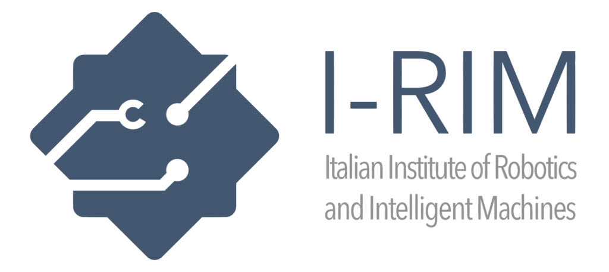

# IRIM 2024 Agri Challenge simulation framework

- Version 1.0.0

---

<div style="display:flex;">
<div style="flex:50%; padding-right:10px; border-right: 1px solid #dcdde1">

**Package summary**

A repository for IRIM-2024 Agri Challenge. Used for build, test, and deployment for the challenge.

- Maintainer status: maintained
- Maintainers
  - Andrea Pupa
  - Clemente Lauretti


</div>
<div style="flex:40%; padding-left:10px;">

**Table of Contents**
- [Overview](#overview)
- [Installation Steps](#installation-steps)
- [Usage](#usage)
- [Issues](#issues)

</div>
</div>

---

## Overview

  

- This repository provides a framework and the URDF for the simulation of the challenge 
- You can find information about the challenge on the <a href="https://i-rim.it/en/challenges-2/">rule page</a>.
- The supported robot for this simulation is the TIAGo Mobile Manipulator, which was developed by PAL Robotics.

---

## Installation Steps

It is assumed that you already have a computer with ROS installed and the required packages for the TIAGo.
If not, follow the tutorial on the official ROS website (Noetic) <a href="http://wiki.ros.org/noetic/Installation">here</a>. Subsequently, install the tiago_tutorials package <a href="http://wiki.ros.org/Robots/TIAGo/Tutorials/Installation/InstallUbuntuAndROS">here</a>.


After this, everything should autoinstall with the command:
```
rosdep install --from-paths src --ignore-src -r -y
```

## Usage
You can run the demo using the launch file:

```
roslaunch agri_challenge tiago.launch
```

Wait a little bit and when everything is ready you can open and close the gripper by publishing on the topic:
```
rostopic pub /gripper_controller/command trajectory_msgs/JointTrajectory "header:
  seq: 0
  stamp:
    secs: 0
    nsecs: 0
  frame_id: ''
joint_names: ["gripper_left_finger_joint", "gripper_right_finger_joint"]
points:
- positions: [SET_THE_VALUE (0-0.05), SET_THE_VALUE (0-0.05)]
  velocities: []
  accelerations: []
  effort: []
  time_from_start: {secs: 1, nsecs: 0}" 
```
While the arm can be controlled publishing on the topic:
```
rostopic pub /arm_controller/command trajectory_msgs/JointTrajectory "header:
  seq: 0
  stamp:
    secs: 0
    nsecs: 0
  frame_id: ''
joint_names: ["arm_1_joint", "arm_2_joint", "arm_3_joint", "arm_4_joint", "arm_5_joint", "arm_6_joint", "arm_7_joint"]
points:                           
- positions: [0, 0, 0, 0, 0, 0, 0]
  velocities: []
  accelerations: []
  effort: []                            
  time_from_start: {secs: 1, nsecs: 0}"
```

### Sensor topics:

The robot is endowed with a camera mounted inside the head, which can be exploited to track the tomatoes inside the environment.
To see the data, check the topics

```
/xtion/...
```
### Head control

An example of C++ node using a head action client is given in tiago_tutorials/look_to_point/src/look_to_point.cpp.

In order to run the node write the following instruction in the second console

```
rosrun look_to_point look_to_point
```
the node will subscribe to the following topics:
```
/xtion/rgb/camera_info

/xtion/rgb/image_raw
```
  
## Issues:

If you encounter any issues, please contact us at our email address:
* andrea.pupa@unimore.it
* c.lauretti@unicampus.it